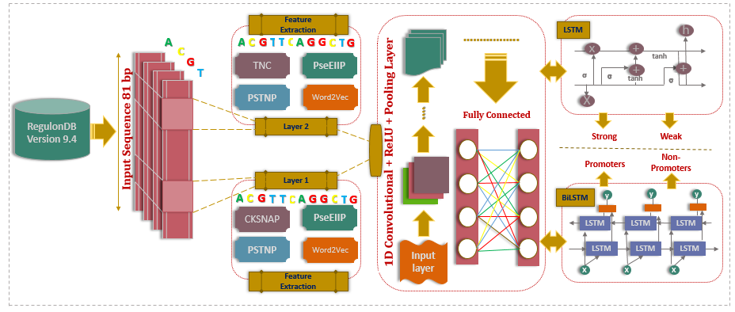

# 🧠 A novel deep learning identifier for promoters and their strength using heterogeneous features
Promoters, which are short (50–1500 base-pair) in DNA regions, have emerged to play a critical role in the regulation of gene transcription. Numerous dangerous diseases, likewise cancer, cardiovascular, and inflammatory bowel diseases, are caused by genetic variations in promoters. Consequently, the correct identification and characterization of promoters are significant for the discovery of drugs. However, experimental approaches to recognizing promoters and their strengths are challenging in terms of cost, time, and resources. Therefore, computational techniques are highly desirable for the correct characterization of promoters from unannotated genomic data. Here, we designed a powerful bi-layer deep-learning based predictor named “PROCABLES“, which discriminates DNA samples as promoters in the first-phase and strong or weak promoters in the second-phase respectively. The proposed method utilizes five distinct features, such as word2vec, k-spaced nucleotide pairs, trinucleotide propensity-based features, trinucleotide composition, and electron–ion interaction pseudopotentials, to extract the hidden patterns from the DNA sequence. Afterwards, a stacked framework is formed by integrating a convolutional neural network (CNN) with bidirectional long-short-term memory (LSTM) using multi-view attributes to train the proposed model. The PROCABLES model achieved an accuracy of 0.971 and 0.920 and the MCC 0.940 and 0.840 for the first and second-layer using the ten-fold cross-validation test, respectively. The predicted results anticipate that the proposed PROCABLES protocol outperformed the advanced computational predictors targeting promoters and their types. In summary, this research will provide useful hints for the recognition of large-scale promoters in particular and other DNA problems in general.
---

## 📘 Overview
we developed an improved predictor ‘PROCABLES’ (PROmoters Classification using CNN, BiLSTM and LSTM modELS) with high efficacy for predicting prompters and their types using sequence information derived from CKSNAP, PseEIIP, PSTNP, TNC and Word2Vec feature encoding approaches. The developed architecture of DL-based model consists of two stages, in the first-stages it predicts promoters from DNA and in the second stage if it predict promoters then further discriminate their functional types as strong promoters and weak promoters respectively. Extensive experiments show that in both levels ensemble deep learning model (CNN+BiLSM) model produced best results on the fused features. The schematic layout of PROCABLES approach is depicted in Fig. 2. The contribution of present research work can be summarized as follows:
a) We designed an intelligent two-layer DL model that predict the promoter region in the first stage and their functional types in second stage respectively.
b) We captured the DNA encoded patterns using Word2Vec algorithm.
c) We analyzed the visual impact of biological features using t-distributed stochastic neighbor embedding method.
d) We enhanced the overall prediction performance of promoters and their functional types (as weak and strong prompters) on both datasets.

---

## 🏗️ System Architecture

The architecture of the system is shown below:
Several fundamental deep models may experience over-fitting and ensemble diversity problems when dealing with small sample sizes. These techniques can teach classifiers more pertinent high-level characteristics. It has emerged as the industry standard classifier in a number of areas, including the classification of cancer subtypes, face anti-spoofing, hyperspectral imaging, radar high resolution range profile recognition, and self-interacting proteins. Bioinformatics data is often heterogeneous, coming from different experimental techniques or sources. Feature fusion techniques can help integrate diverse types of information, making the model more adaptable to varying data modalities. This aid our model in gaining insights into the factors influencing the prediction of promoters and non-promoters. PROCABLES is an ensemble-based method that uses feature fusion approaches CKSNAP, PseEIIP, PSTNP, TNC and Word2vec with CNN, LSTM, and BiLSTM. layers rather than specific neural network topologies for feature learning in each layer. Due to its deep-type design, the deep model’s technique is dependable and appropriate for training with small amounts of data. PROCABLES is better at tweaking the hyper parameter than DNN. The PROCABLES classifier has a higher ability for discrimination than other classification algorithms due to its excellent learning potential. To carry out this experiment, we used Python 3.10.10, TensorFlow 2.10.0, and Keras 2.10.0. The hyper parameters in this work as provided Supplementary file Table S1. To identify promoters, we used 2 layers of CNN+BiLSTM and dense layer as well while to classify strength of promoters, 1 layer of CNN+LSTM and dense layer is used and set epoch size to 30, batch-size to 128 and learning rate to 0.1 for both layers.

<p align="center">
  
</p>

---

## 🚀 Features

- ✅ [Feature 1: Short explanation]  
- ✅ [Feature 2: Short explanation]  
- ✅ [Feature 3: Short explanation]  
- ✅ [Feature 4: Short explanation]  

---

## 🧠 Methodology

[Describe your approach in more technical detail — e.g., models used, algorithms, or workflow.]

Example outline:
1. **Data preprocessing:** [describe steps]
2. **Model design:** [describe model layers, architecture, etc.]
3. **Training process:** [epochs, loss function, optimizer, etc.]
4. **Evaluation:** [metrics, datasets used, etc.]

---

## ⚙️ Installation

Follow these steps to set up the environment and run the project:

```bash
# 1️⃣ Clone the repository
git clone https://github.com/[username]/[repo-name].git
cd [repo-name]

# 2️⃣ Create and activate a virtual environment (optional)
python -m venv venv
source venv/bin/activate   # (Linux/Mac)
venv\Scripts\activate      # (Windows)

# 3️⃣ Install dependencies
pip install -r requirements.txt
